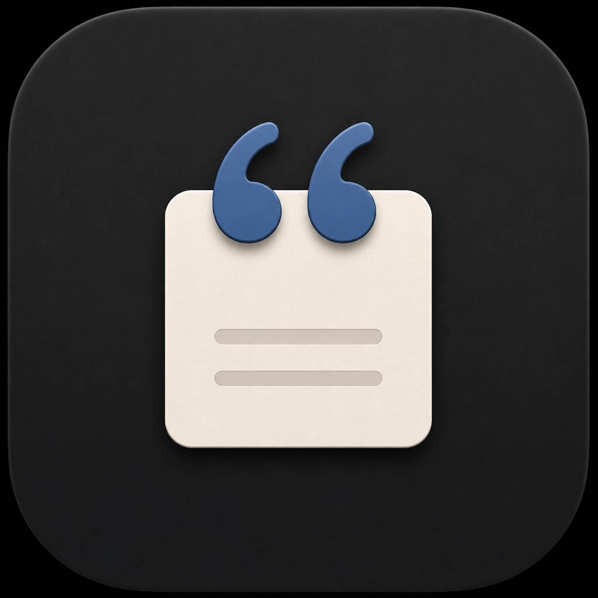
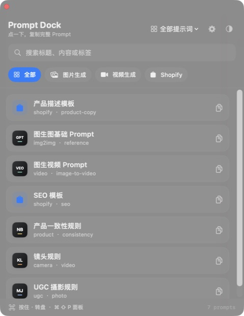
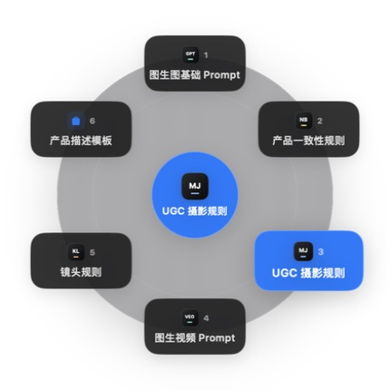
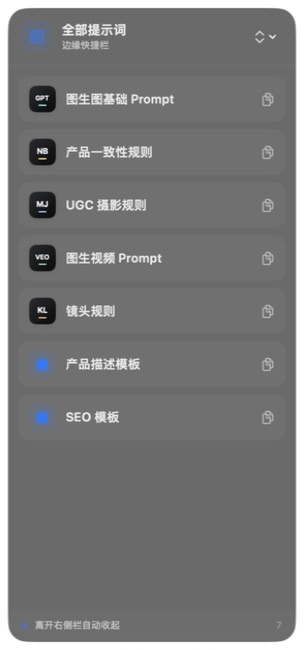
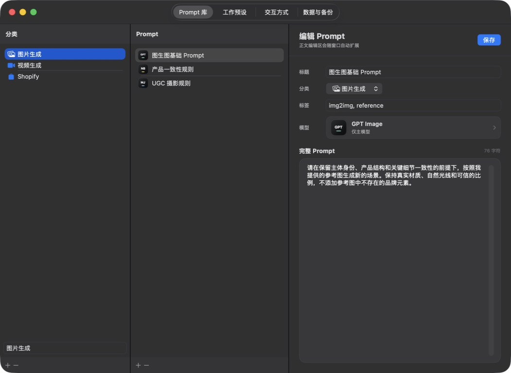
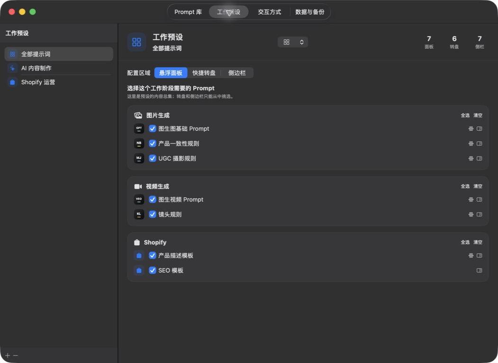
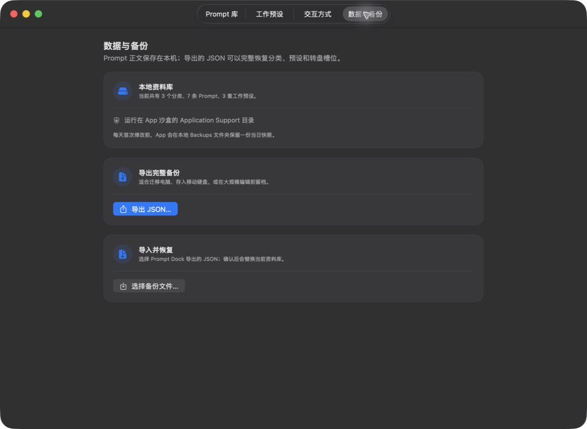

# Prompt Dock

<p align="center">
  <strong>简体中文</strong> · <a href="README_EN.md">English</a>
</p>

<p align="center">
  
</p>

<p align="center">
  <strong>把几千字的 Prompt，缩短成一次点击或一个手势。</strong><br>
  一个本地优先、始终置顶的 macOS AI 工作流快捷面板。
</p>

<p align="center">
  SwiftUI · macOS Native · Local First · MIT
</p>

Prompt Dock 不是笔记软件。后台负责整理完整 Prompt 库和不同工作预设，前台只保留此刻真正要用的快捷入口。它适合频繁在 ChatGPT、Gemini、Grok、图像模型和视频模型之间切换的人。

## 三种使用速度

同一套 Prompt 可以出现在三种界面中。你可以完整浏览，也可以把最常用的内容压缩成一次手势。

<table>
  <tr>
    <td align="center" width="33%"></td>
    <td align="center" width="33%"></td>
    <td align="center" width="33%"></td>
  </tr>
  <tr>
    <td align="center"><strong>悬浮面板</strong><br>始终置顶，搜索、分类和浏览完整工作集；点击卡片立即复制。</td>
    <td align="center"><strong>快捷转盘</strong><br>按住 <code>·</code>，移动到目标并松开；选择与复制在一个手势内完成。</td>
    <td align="center"><strong>屏幕边缘栏</strong><br>平时隐藏，触碰屏幕边缘时出现；几乎不占用工作画面。</td>
  </tr>
</table>

## 后台是一张工作台

资料库与快捷界面彼此分离：先保存完整内容，再决定不同工作阶段要显示什么。这样无需依赖固定的“最近使用”或“收藏”，每个人都能建立自己的 AI 工作流。

### 1. Prompt 可完整编辑

按「分类 → Prompt」管理标题、正文、标签和适用模型。Prompt 可以很长，日常面板仍然只显示一个轻量快捷卡片。

<p align="center">
  
</p>

### 2. 工作预设可自由配置

为“AI 内容制作”“Shopify 运营”或任何工作阶段建立独立预设，并分别挑选悬浮面板、转盘和边缘栏里出现的 Prompt。预设之间可以随时切换，不复制 Prompt 正文。

<p align="center">
  
</p>

### 3. 可导入、导出与本地备份

整个资料库可导出为 JSON，内容包括分类、Prompt、工作预设和转盘槽位。也可以通过 JSON 恢复；首次修改前还会在本机保留每日快照。

<p align="center">
  
</p>

> README 截图使用隔离的内置演示资料，不包含开发者或用户的私人 Prompt。

## 当前功能

- 始终置顶、可拖动、可缩放的毛玻璃面板
- 分类、标签与全文搜索
- Prompt 的新增、编辑、删除和分类管理
- 多套工作预设，分别配置面板、4/6/8 槽位转盘和侧边栏
- 每条 Prompt 可独立指定模型图标和兼容模型
- 点击卡片复制完整 Prompt，并显示成功反馈
- 按住 `·`、移动、松开完成复制；支持拖回中心取消
- 左侧或右侧屏幕边缘快捷栏
- `Command + Shift + P` 全局显示或隐藏面板
- 菜单栏常驻、透明度调节和深色模式
- 本地 JSON 存储、每日快照、导入与导出
- 无账号、无广告、无分析 SDK、无服务器依赖

## 为什么做它

长 Prompt 经常散落在备忘录和文档里。真正耗时的并不是复制，而是反复查找、展开、选择，再切回 AI 工具。Prompt Dock 想验证三个问题：

- 始终置顶的工作集能否减少应用切换？
- 自定义工作预设是否比固定的最近使用和收藏更贴合不同任务？
- 按住、移动、松开的转盘，是否能把常用 Prompt 的复制压缩成一次动作？

如果你有类似工作流，欢迎使用 GitHub Issues 分享场景。请勿在 Issue、截图或日志中粘贴私人 Prompt、API Key 或客户数据。

## 系统要求

- macOS 14 或更高版本
- Xcode 16 或更高版本（当前版本已在 Xcode 26.6 验证）

## 本地运行

1. 克隆或下载本仓库。
2. 使用 Xcode 打开 `AIPromptDock.xcodeproj`。
3. 选择 `My Mac`，点击 Run。
4. 如需使用单键 `·` 转盘，在系统提示后前往“系统设置 → 隐私与安全性 → 辅助功能”授权。

App 是菜单栏应用，不会常驻 Dock。关闭面板只会隐藏；可通过菜单栏图标或 `Command + Shift + P` 再次打开。

## 本地数据

App Store 沙盒构建的数据位于：

```text
~/Library/Containers/com.ayu.AIPromptDock/Data/Library/Application Support/AIPromptDock/library.json
```

Prompt 正文、分类和工作预设默认只保存在本机。仓库只包含通用示例 Prompt，不包含开发者的个人资料库。

## 项目结构

- SwiftUI：面板、管理后台、转盘和边缘栏界面
- AppKit：悬浮窗口、菜单栏和屏幕层级
- Codable JSON：本地资料库、迁移与备份
- Carbon / CGEvent：组合快捷键与经授权的单键监听

更详细的说明见 [技术架构](Docs/ARCHITECTURE.md)、[数据模型](Docs/DATA_MODEL.md) 和 [项目结构](Docs/PROJECT_STRUCTURE.md)。

## 当前限制

- 暂无 iCloud 或多设备同步
- 暂无团队共享和 Prompt 市场
- 分类与 Prompt 暂不支持拖动排序
- 本地开发签名更新后，macOS 可能要求重新确认辅助功能权限
- 尚未提供经过公证的安装包，请使用 Xcode 本地构建
- 本机日常更新请运行 `Scripts/install-local.sh`；它会使用稳定的本地签名，避免单键转盘权限在每次更新后失效

## 参与贡献

问题反馈和代码贡献见 [CONTRIBUTING.md](CONTRIBUTING.md)。安全问题见 [SECURITY.md](SECURITY.md)。

## 许可证

[MIT License](LICENSE)
